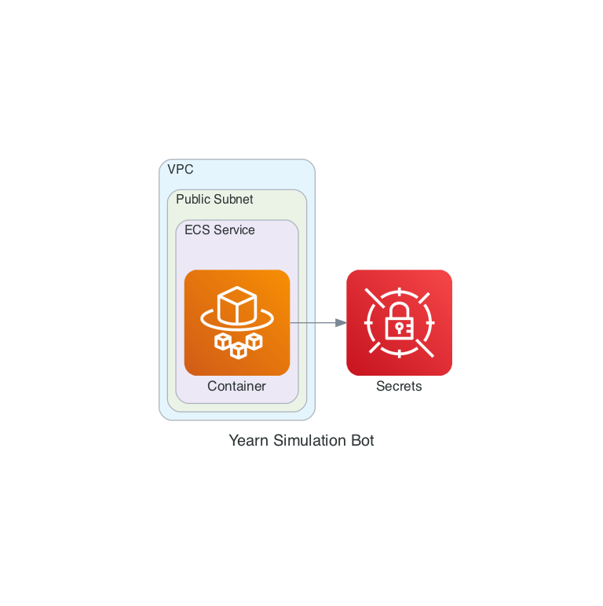

# Welcome to your CDK Python project!

This is a blank project for Python development with CDK.

The `cdk.json` file tells the CDK Toolkit how to execute your app.

This project is set up like a standard Python project.  The initialization
process also creates a virtualenv within this project, stored under the `.venv`
directory.  To create the virtualenv it assumes that there is a `python3`
(or `python` for Windows) executable in your path with access to the `venv`
package. If for any reason the automatic creation of the virtualenv fails,
you can create the virtualenv manually.

To manually create a virtualenv on MacOS and Linux:

```
$ python3 -m venv .venv
```

After the init process completes and the virtualenv is created, you can use the following
step to activate your virtualenv.

```
$ source .venv/bin/activate
```

If you are a Windows platform, you would activate the virtualenv like this:

```
% .venv\Scripts\activate.bat
```

Once the virtualenv is activated, you can install the required dependencies.

```
$ pip install -r requirements.txt
```

At this point you can now synthesize the CloudFormation template for this code.

```
$ cdk synth
```

To add additional dependencies, for example other CDK libraries, just add
them to your `setup.py` file and rerun the `pip install -r requirements.txt`
command.

## Useful commands

 * `cdk ls`          list all stacks in the app
 * `cdk synth`       emits the synthesized CloudFormation template
 * `cdk deploy`      deploy this stack to your default AWS account/region
 * `cdk diff`        compare deployed stack with current state
 * `cdk docs`        open CDK documentation

Enjoy!

# Infrastructure Diagram


# First Time Setup

This section will guide you through setting up your infrastructure for the simulation bot.

The infrastructure is defined using **[AWS Cloud Development Kit (AWS CDK)](https://aws.amazon.com/cdk/)**. AWS CDK is an open source software development framework to define your cloud application resources using familiar programming languages.

These definitions can then be synthesized to AWS CloudFormation Templates which can be deployed AWS.

## Initial Setup

Follow the steps to bootstrap your AWS Account to work with AWS CDK:

1. [Prerequisites](https://docs.aws.amazon.com/cdk/latest/guide/getting_started.html#getting_started_prerequisites) 
2. [Install AWS CDK Locally](https://docs.aws.amazon.com/cdk/latest/guide/getting_started.html#getting_started_install)
3. [Bootstrapping](https://docs.aws.amazon.com/cdk/latest/guide/getting_started.html#getting_started_bootstrap)

The infrastructure in this repository requires a VPC with at least one public subnet. If you don't have a VPC that meets this criteria or want to provision a new VPC for this project, you can follow the instructions [here](https://docs.aws.amazon.com/AmazonECS/latest/developerguide/create-public-private-vpc.html).

## Creating the Infrastructure for the First Time

You can use the `cdk-deploy-to.sh` script to deploy the infrastructure for the first time and any subsequent updates to the infrastructure.

**Note:** Some of the infrastructure is dynamically configure based on what *Scheduled Scripts* have been configured in the [yearn-simulations](https://github.com/yearn/yearn-simulations). You must have a local copy of this repository during the initial provisioning. 

Install all the requirements:

```bash
> pip install -r requirements-dev.txt  # Install cdk requirements
> pip install -r /Users/gazumps/Repos/yearn-simulations/requirements.txt  # Install requirements from the yearn-simulations project
> pip install eth-brownie>=0.17.0 # Install brownie
```

Usage:

```bash
> YEARN_SIMULATIONS_WORKSPACE="/Users/gazumps/Repos/yearn-simulations" ./cdk-deploy-to.sh <AWS Account ID> <AWS Region> <AWS VPC ID>
```

Example:

```bash
> YEARN_SIMULATIONS_WORKSPACE="/Users/gazumps/Repos/yearn-simulations" ./cdk-deploy-to.sh 1111111111 us-east-1 vpc-11111111 --require-approval never
```

## Initializing Secrets

One of the resources created during the creation process is a **AWS Secrets Store**. Navigate to the newly created secrets store and modify the following values in the **Secret value** section for the Harvest Simulation Bot:

1. TELEGRAM_YFI_HARVEST_SIMULATOR
2. WEB3_INFURA_PROJECT_ID
3. INFURA_ID
4. TELEGRAM_BOT_KEY
5. POLLER_KEY

And the following secrets for the scheduled bots:
1. INFURA_ID
2. WEB3_INFURA_PROJECT_ID
3. TELEGRAM_BOT_KEY
## GitHub Actions

To configure GitHub Actions, you need to create an environment named `production` [here](https://github.com/yearn/yearn-simulations/settings/environments) and add the following secrets:

1. `AWS_ACCESS_KEY_ID`
2. `AWS_SECRET_ACCESS_KEY`

## Destroying The Environment

You can destroy the environment using CDK:

```bash
> YEARN_SIMULATIONS_WORKSPACE="/Users/gazumps/Repos/yearn-simulations" CDK_DEPLOY_VPC="vpc-11111111" CDK_DEPLOY_ACCOUNT="1111111111" CDK_DEPLOY_REGION="us-east-1" cdk destroy --all
```
